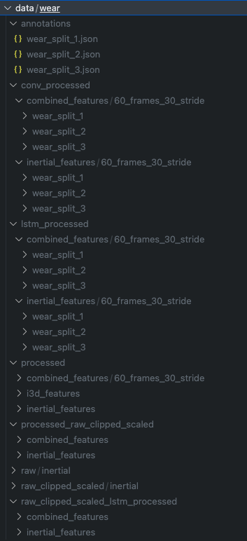
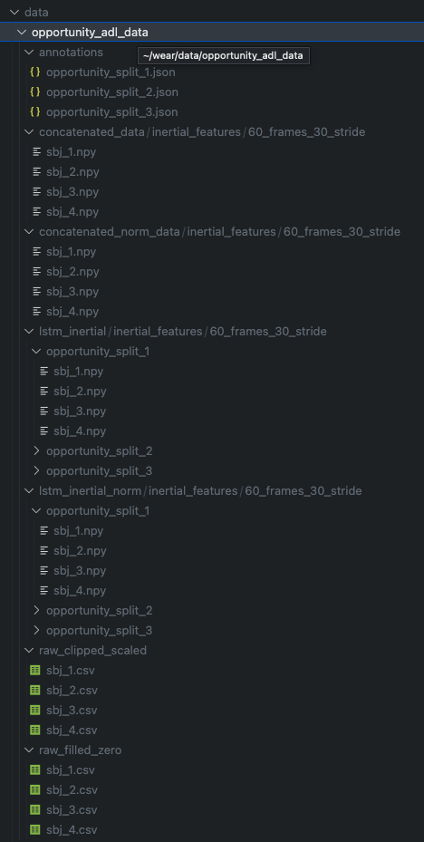

# Enhancing Activity Recognition

## Abstract
Human Activity Recognition (HAR) plays a crucial role in understanding and interpreting human behaviour, especially in dynamic and real-world settings. HAR involves the use of sensor data to identify and classify different activities performed by individuals, contributing to applications such as health monitoring, and sports analysis. In their recent work, Bock et al. introduced the WEAR dataset, a groundbreaking resource designed for outdoor sports activity recognition using wearable devices and egocentric vision. Leveraging this dataset, they demonstrated the effectiveness of a Deep Convolutional LSTM network (DeepConvLSTM) with inertial data. Furthermore, Bock et al. explored Temporal Action Detection (TAD) vision networks, including ActionFormer and TriDet, incorporating various combinations of inertial and Inflated 3D (I3D) features.

This report builds upon Bock et al.’s work, presenting a novel approach to further enhance Human Activity Recognition methodologies. Three significant contributions are outlined. Firstly, the report introduces a unique methodology for leveraging pre-trained Convolutional and LSTM inertial features derived from the DeepConvLSTM network in the training of the ActionFormer and the TriDet models. Secondly, meticulous benchmarking and performance analysis are conducted on both the WEAR dataset and the Opportunity Daily Activity runs dataset (Opportunity ADL), exploring various combinations of inertial features. Lastly, a comprehensive methodology for preprocessing HAR datasets is proposed, underscoring its pivotal role in refining model performance. The results demonstrate that the integration of pre-trained Convolutional and LSTM inertial features significantly enhances the performance metrics of the ActionFormer and TriDet models. Notably, the TriDet model consistently outperforms the ActionFormer model across diverse inertial feature types, showcasing improvements in F1 scores and mean Average Precision(mAP). Additionally, the preprocessing methodology contributes to the overall effectiveness of the models, emphasizing the importance of thoughtful data preparation in HAR tasks. The Code to reproduce experiments is publicly available [here](https://github.com/hrudaykolla/wear)

## Instruction
Follow README.md file for the installation and reproduction of experiments.

## Reproducing Experiments of Studienarbeit
The experiments of studienarbeit are done on WEAR and Opportunity ADL datasets on 1 Second windows. Below are the folder strucutures for running the experiments.

# Data folder structure for Opportunity WEAR data


Get the raw data, processed data and annotations from the link given in README.md
Using the ./raw_wear_normalization/data_norm.ipynb file obtain raw_clipped_scaled inertial features.
Using the ./raw_wear_normalization/4_create_features_and_annotations.py obtain processed raw clipped scaled inertial features.
Using the above data, corresponding LSTM features and Convolutional features are saved in the folders when the config files are run.

# Data folder structure for Opportunity ADL data


Get the raw data from here(http://opportunity-project.eu/system/files/Challenge/OpportunityChallengeLabeled.zip), unzip to this folder.
Using, ./opportunity_normalization/data_combining.ipynb, .dat files of each subject can be combined to one file and all four subject file is combined to one file for further analysis.
Using ./opportunity_normalization/main.ipynb further analysis can be done and normalization files are obtained.
Using the ./raw_wear_normalization/data_norm.ipynb file obtain raw_clipped_scaled inertial features.
Using the ./raw_wear_normalization/4_create_features_and_annotations.py obtain processed raw clipped scaled inertial features.
Using the above data, corresponding LSTM features and Convolutional features are saved in the folders when the config files are run.


Once having installed requirements, one can rerun experiments by running the `main.py` script:

````
python main.py --config ./configs/60_frames_30_stride/actionformer_combined.yaml --seed 1 --eval_type split
````

Each config file represents one type of experiment. Each experiment was run three times using three different random seeds (i.e. `1, 2, 3`). To rerun the experiments without changing anything about the config files, please place the complete dataset download into a folder called `data/wear` in the main directory of the repository.

